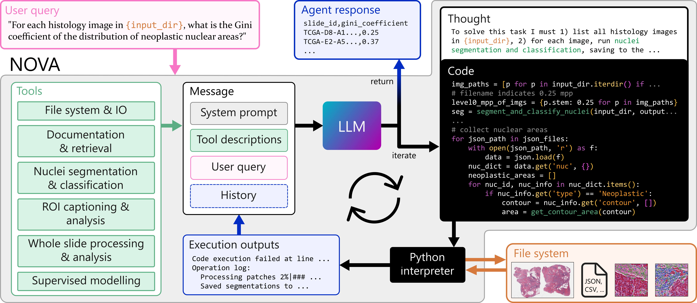
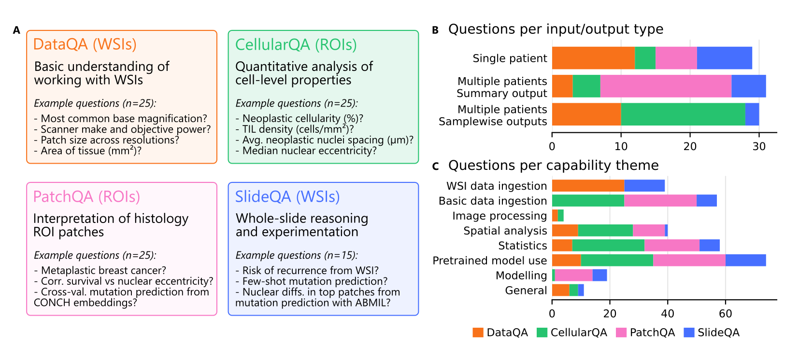

# NOVA

[arXiv](https://arxiv.org/abs/2511.11324) | [Getting Started](#installation) | [Cite](#reference) | [License](LICENSE)

NOVA is a modular agentic framework, based on [CodeAct](https://arxiv.org/abs/2402.01030v4) and developed using [smolagents](https://huggingface.co/docs/smolagents/index), that dynamically generates and executes Python code to orchestrate tool usage and answer user queries for scalable computational analysis. NOVA integrates 49 domain-specific tools (e.g., nuclei segmentation, whole-slide encoding) built on open-source software, and can also create new tools ad hoc.



# SlideQuest

To evaluate NOVA's capabilities, we introduce [SlideQuest](benchmark), a benchmark of 90 questions designed to evaluate computational agents in pathology. The tasks span four categories, including  pyramidal data interrogation ([DataQA](benchmark/data_qa)), cellular analysis ([CellularQA](benchmark/cellular_qa)), histology ROI understanding ([PatchQA](benchmark/patch_qa)), and gigapixel slide-level experimentation ([SlideQA](benchmark/slide_qa)).



## Getting started

### Installation

First clone the repository:

```shell
git clone https://github.com/microsoft/nova-agent.git
cd nova-agent
```

This repository uses [mise-en-place](https://github.com/novelbio/mise-en-place) for dev environment setup. Run the following make and just commands to install and set up the environment:

```shell
make mise  ## install mise and necessary tools (just, uv, python, etc)
just env  ## setup the environment
```

`make mise` will install necessary tools including [just](https://just.systems/man/en/), [uv](https://docs.astral.sh/uv/), etc.
You can check the [Makefile](Makefile) and [Justfile](Justfile) for more details on what these recipes run.

The environment is built with [uv](https://docs.astral.sh/uv/) for fast virtual environment management.

### Setup your LLM api

Modify `configs/llms/default_llm.yaml` to set your LLM API base URL.
You can also override the base URL at runtime using the command line argument `baseline.llm.api_config.base_url`.

### Known Issues

NOVA relies on [Hover-net](https://github.com/vqdang/hover_net) for cell segmentation which is setup as a [git submodule](.gitmodules) in this repository.

You may encounter the following error when ruuning queries that require multiprocessing:

```python
ERROR: ctypes objects containing pointers cannot be pickled
```

This is due to the change of multiprocessing strategy to `spawn` in Hover-net.
To fix this error, remove or comment `mp.set_start_method("spawn", True)` in
[infer/wsi.py](src/nova/toolkits/nuc_seg/hover_net/infer/wsi.py#L5)
and
[infer/tile.py](src/nova/toolkits/nuc_seg/hover_net/infer/tile.py#L5) in hovernet.

### Run NOVA for exploration

If you wish to run NOVA in exploration mode using `gradio` capabilities provided by `smolagents`, run the following command:

```shell
uv add smolagents[gradio]
uv run python src/nova/main.py baseline.llm.api_config.base_url=<your_base_url>
```

This will launch a Gradio interface for interactive exploration of NOVA's capabilities. You will be able to visualize and interact with the various tools and agents integrated within NOVA described on the left of the interface.

### Run NOVA on SlideQuest

We provide a custom benchmark [`runner`](src/nova/experiments/runner.py) for SlideQuest. To run nova on SlideQuest, use the following command:

```shell
uv run python src/nova/experiments/run_experiment.py \
    --config-name experiments/codeagent_with_tools \
    run.subfolder_working_dir=True \
    baseline.llm.api_config.deployment_name=gpt-4.1 \
    baseline.llm.api_config.base_url=<your_base_url> \
    categories=[data_qa] \
    benchmark.limit=2
```

Explore the config [`codeagent_with_tools`](configs/experiments/codeagent_with_tools.yaml) for more details on what options are available.

### Debugging NOVA on SlideQuest

We provide a debugging config in [.vscode/launch.json](.vscode/launch.json) to facilitate debugging experiments. This will allow you to step through the code and inspect variables during execution in case you encounter any issues.

## Reference

We kindly request that you cite our paper if any part of this code is used in your work.

```bibtex
@misc{vaidya2025novaagenticframeworkautomated,
      title={NOVA: An Agentic Framework for Automated Histopathology Analysis and Discovery},
      author={Anurag J. Vaidya and Felix Meissen and Daniel C. Castro and Shruthi Bannur and Tristan Lazard and Drew F. K. Williamson and Faisal Mahmood and Javier Alvarez-Valle and Stephanie L. Hyland and Kenza Bouzid},
      year={2025},
      eprint={2511.11324},
      archivePrefix={arXiv},
      primaryClass={cs.CL},
      url={https://arxiv.org/abs/2511.11324},
}
```

## Contributing

This project welcomes contributions and suggestions.  Most contributions require you to agree to a
Contributor License Agreement (CLA) declaring that you have the right to, and actually do, grant us
the rights to use your contribution. For details, visit <https://cla.opensource.microsoft.com>.

When you submit a pull request, a CLA bot will automatically determine whether you need to provide
a CLA and decorate the PR appropriately (e.g., status check, comment). Simply follow the instructions
provided by the bot. You will only need to do this once across all repos using our CLA.

This project has adopted the [Microsoft Open Source Code of Conduct](https://opensource.microsoft.com/codeofconduct/).
For more information see the [Code of Conduct FAQ](https://opensource.microsoft.com/codeofconduct/faq/) or
contact [opencode@microsoft.com](mailto:opencode@microsoft.com) with any additional questions or comments.
